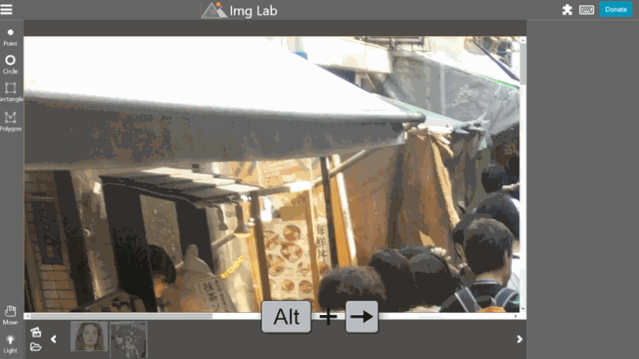
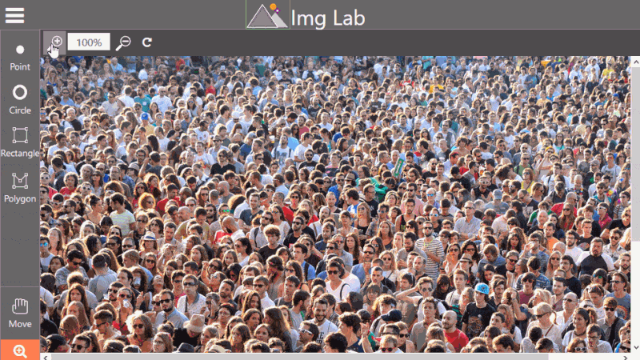

# [imglab](http://imglab.ml/)

A web based tool to label images for objects that can be used to train dlib or other object detectors.

[](http://www.firsttimersonly.com/)
[](https://salt.bountysource.com/teams/imglab)

<a href="https://opencollective.com/imglab/donate" target="_blank">
  
</a>
<a href="https://www.patreon.com/bePatron?u=9531404" data-patreon-widget-type="become-patron-button"></a>
<a href="https://www.paypal.com/cgi-bin/webscr?cmd=_s-xclick&hosted_button_id=KQJAX48SPUKNC"> </a>
<a href="https://liberapay.com/amitgupta/donate"></a>

<div align="center"></div>


> With most users switching over to the new version of imglab, the legacy version of imglab has been removed.

> If you would like to be a maintainer/collaborator of this project/organization, please let me know. The only condition is that you need to be polite to any user feedback.

## Features

ImgLab is platform independent, runs directly from the browser, and has no prerequisites. It requires minimal CPU and memory.

One of imglab's key advantages is that you can use 3rd party libraries to **fast annotation process**, which can save a lot of time and effort.

**Other features**:

* Special attention for dlib users. You can easily adjust the order of parts / landmarks / featurepoints.
* Open-source and free forever.
* You can draw feature points and shapes (circles, rectangles, polygons). Other shapes like ellipses, lines, curves will be added in the future if there is demand. 
* Small project file so it can be shared over the mail. In [निम्न (Nimn)](http://nimn.in) data format
* Multiple formats are supported
  * dlib XML
  * dlib pts
  * Pascal VOC
  * COCO
  * Tenserflow (in plan)
  
**Other quality-of-life features**:

* Drag or resize any annotation shape.
* Select and delete any annotation shape or landmark points.
* Arrange landmark points in specific order by dragging their label up & down, instead of creating them in a particular order.
* Autosave in browser cache. Export to save on disk.
* Hotkeys support for easy switching between images, tools, labelling data, or to access other parts of the application for added convenience.
* Set image opacity to highlight annotation shapes and points.
* Tracking lines and mouse coordinates for precise annotations.

## How to use

You can either import a file from a URL or from your computer. You can plot the landmark points by yourself or you can request to face++ API to collect the points which automatically gets plotted on the image (You will need to register on face++ to use the API.). If you feel that the result should be improved, you can drag a point to the correct location. Check [Demo video](https://youtu.be/Y-bJo_ylHTw) on Youtube.

### Keyboard Shortcuts:

*File Management:*

* Shift + Alt + O : Open image folder.
* Ctrl + I : Import data file.
* Ctrl + E : Export data file.
* Alt + Left/Right Arrow : Navigate through images in the slider.

*Image Manipulation:*

* Del : Delete selected shapes or feature points.
* Enter : Confirm action.
* Alt + A : Select all shapes.
* Ctrl + Directional Arrow : Move the currently selected shape in the corresponding direction.

*Toolbar Shortcuts:*

* Alt + F : Feature Point
* Alt + C : Circle
* Alt + R : Rectangle
* Alt + P : Polygon
* Alt + M : Move
* Alt + L : Light
* Alt + E : Ellipse
* Alt + + (Plus key) : Zoom
* Alt + W : Magic wand


### Auto suggestion


### Plugins


### Different Shapes


### Keyboard Shortcuts:



### Zoom In/Out:



Check [video](https://youtu.be/Y-bJo_ylHTw) tutorial/demonstration or a list of notable [features](docs/features.md) for more details.

## Getting Started

To use it offline, you can either download installers or clone this repo and run it on a local server.

### Installing

1. Fork this repository on github and make a clone from your forked copy
```
$ git clone 'your_local_fork_on_github'
```

### Setup local environment

1. Install node and npm
2. Open the terminal and run `$ npm install -g live-server` to install node live server.
3. Run `$ live-server` in /imglab/ folder.
4. Open your browser (if it hasn't popped up already) at: `http://127.0.0.1:8080/`

*Nore that* [live-server](https://www.npmjs.com/package/live-server) is just an app to run the server in easy way. You may try any other option as well. 

## Contributing 

Please read [CONTRIBUTING.md](https://github.com/NaturalIntelligence/imglab/blob/master/.github/First_Time_Contributors.md) for details on our code of conduct, and the process for submitting pull requests to us.

## Built with

This application is built upon following technology stack.

* [jQuery](https://jquery.com)
* [Bootstrap](https://getbootstrap.com)
* [Riot.js](https://github.com/riot/riot) - Simple and elegant component-based UI library
* [SVG.js](http://svgjs.com)

## Showcase your work

While using this library, if you happen to build an open database that can help other users or something you would like to showcase, please raise an issue or PR.

## Worth to mention

- [Stubmatic](https://github.com/NaturalIntelligence/Stubmatic) : Mock web servers and services. Designed specialy for testers and testing. 
- [अनुमार्गक (anumargak)](https://github.com/node-muneem/anumargak) : Amazing fast router for node web servers.
- **[मुनीम (Muneem)](https://github.com/node-muneem/muneem)** : Simple and fast web framework designed not only for developers but whole team.
- [Match it](https://funcards.github.io/match-it/) : Generate Spot it like card game decks. 

*Note that* All above mentioned projects are free to use and welcome contributors.

## Contributors

<a href="https://github.com/NaturalIntelligence/imglab/graphs/contributors"></a>

